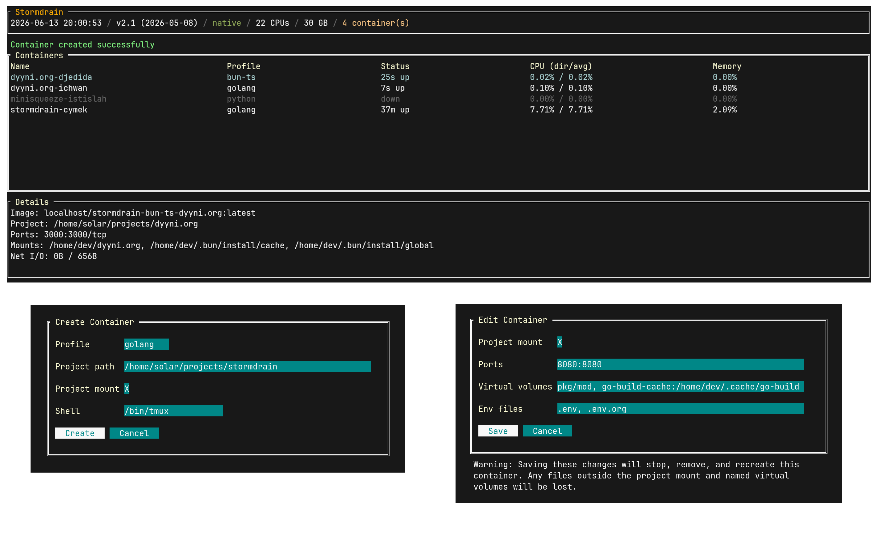

# stormdrain

Opinionated take on a declarative dev container management tool. Built directly on top of rootless Podman command line interface.

## Basics

### Quickstart

Run the included `scripts/init.sh` shell script to copy the example profiles and the base template into `~/.config/stormdrain`. Then run `scripts/build.sh` which produces the plug-and-play binaries into `bin`.

### Profiles

Declarative JSON configuration files, "profiles", form up the base layer for the tool's functionality. The hardcoded location for these is currently `~/.config/stormdrain/profiles`. More comprehensive examples of these config files are available in `example_profiles`, but in general the system abides the following directives:

- `shell`: Login shell for the container user (`dev` by default), defaults to `/bin/zsh`
- `packages`: List of APT packages to install during image build
- `installers`: List of shell commands (or multiple chained commands) executed during image build (by the container user, needs `sudo` for root)
    - An unstructured way to expand the configuration to be compatible with e.g. multistep installation scripts (see `example_profiles/golang.json`)
- `configs`: Host files/dirs to copy into the image at build time
    - Format: `{ "src": <path>, "dst": <path>, "exclude": <pattern> }`
- `project_mount`: Whether to bind-mount the project directory into the container at `/home/dev/<project>` and set it as the working dir, defaults to `true`
- `ports`: Host-to-container port forwarding
    - Format: `{ "host": <port>, "container": <port> }`
- `virtual_volumes`: Named podman volumes (owned by the container user, `dev` by default) for persistent container-local storage (e.g. caches)
    - Format: `{ "name": <name>, "path": <path_on_container> }`
- `env_files`: Host `.env` files whose key-value pairs are injected as environment variables into the container at runtime

Notably variables like ports, volume mounts, project mount, etc. are also configurable via the container recreation view (mapped to `e` by default) so that the profiles don't need to be adjusted to accompany every little per-project modification.

### Container creation

During the container creation process, the configurations from the selected profile and the creation view are injected into a base template container image (`Dockerfile.base` by default, uses `buildpack-deps:trixie` as the base image) by replacing the existing placeholders (`{{PROFILE_PKGS}}`, `{{PROFILE_DIRS}}`, `{{PROFILE_INSTALLERS}}`, and `{{PROFILE_CONFIGS}}`).

To persist the container configurations across (container) reboots and recreations, a `.stormdrain` directory is created to the given project root. Inside it will be scoped directories for each container of that particular workspace, and within those subdirectories will be the following files:

- `Dockerfile.sd`: The substituted Dockerfile where the user-given configurations are combined with `Dockerfile.base`
- `pod_spec.json`: The actual container config, stores metadata like name, project path, image tag, volume mounts, etc.
- `build.log`/`recreate.log`: Log files produced during initial container creation and recreation (triggered by configuration changes)

Besides the aforementioned directories, a temporary `configs` directory will be created to stage the copiable dotfiles into the container's build scope. It's cleaned up automatically after the container creation process finishes.

### Keyboard mappings

|  Key | Action |
| - | - |
| `j/k` | Navigation (down/up) |
| `q` | Quit |
| `n` | New container (via form) |
| `e` | Edit container config (ports, volumes, env files, project mount) |
| `s` | Stop selected container |
| `x` | Kill (force stop) selected container |
| `d` | Remove selected container |
| `p` | Purge all existing (stormdrain) containers, images, volumes, and `.stormdrain` directories |
| `a` | Attach into selected container (suspends TUI) |

---

###### Mirrors: [Codeberg](https://codeberg.org/2ug/stormdrain) / [Github](https://github.com/200ug/stormdrain)
